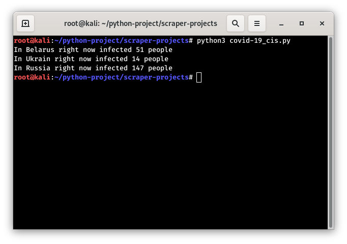

# COVID-19-statistic
This software will help you to monitor the statistics of the spreading of coronovirus in the Post-Soviet countries (Belarus, Russia, Ukraine). Implemented in python asynchronously. 

